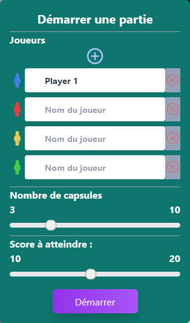
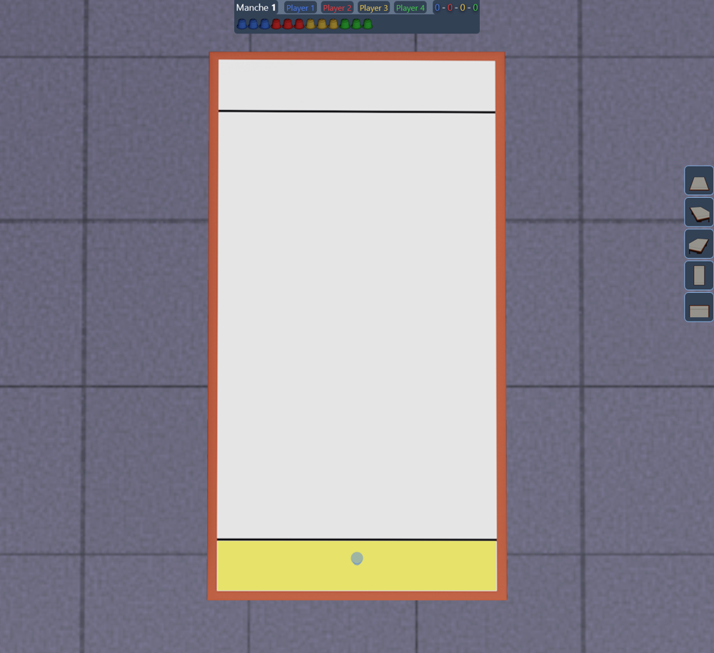
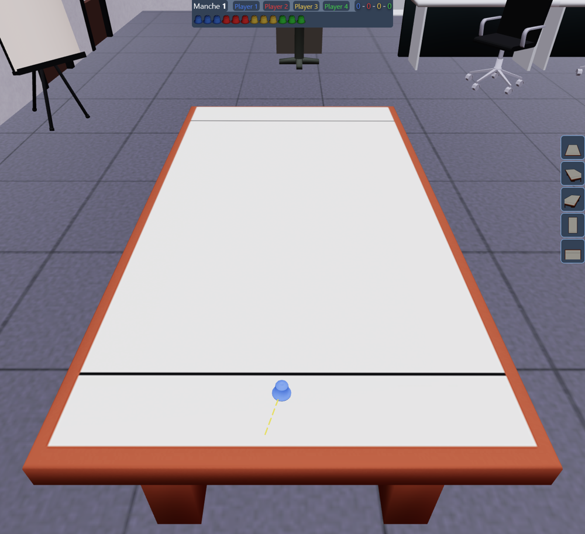
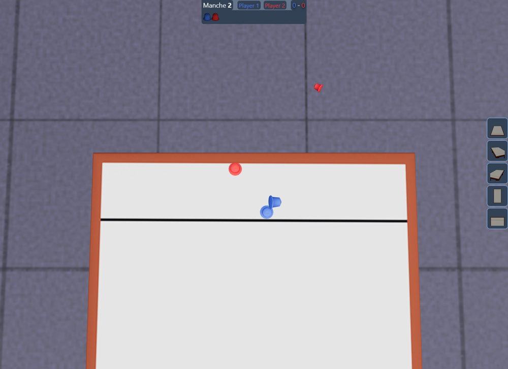
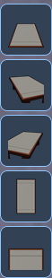

## NesCurling, The Game

https://guil-martin.github.io/NesCurling/

### 1 - Démarrer une partie

#### Joueurs

Ajouer jusqu'à 4 joueurs qui s'opposeront en chacun pour soi.

#### Nombre de capsules

Augmenter ou diminuer ce nombre pour déterminer le nombre de capsules à jouer par joueur et par manche durant la partie.

#### Score à atteindre

Augmenter ou diminuer ce nombre pour déterminer combien de point un joueur aura besoin de marquer pour gagner

### 2 - Début de partie

A chaque tour, le joueur dont c'est le tour choisi un emplacement de départ pour sa capsule :

Losque l'emplacememnt est validé le joueur peut alors cliquer et faire glisser la souris dans la direction opposée à laquelle il souhaite propulser sa capsule et relâcher le bouton gauche de la souris pour propulser la capsule (mécanique de lance-pierre) :

### 3 - Comment jouer

#### But

Le but du jeu est de placer ses capsules derrière la ligne de l'autre côté de la table et le plus près possible du bord, devant les capsules des autres joueurs.

#### Tour de jeu

Le joueur qui jouera au prochain tour est toujours celui qui n'a pas de capsules dans la zone de score ou qui a sa ou ses capsules est placée(s) le plus loin du bord, dans l'exemple de l'image ci-dessus, le joueur bleu devra jouer ses capsules tant qu'il lui en reste et tant que la capsule rouge reste en devant ses capsules dans la zone de score.

#### Techniques

Il est bien entendu possible et même recommandé de se servir de ses capsules pour faire tomber celles des adversaires pour permettre par exemple de marquer plusieurs points d'un coup ou bien simplement d'empêcher un adversaire de marquer des points.

#### Gagnant

Le gagnant est celui qui marque le nombre de points à atteindre en premier, le résultat de cette partie sera sauvegardé localement dans le navigateur.

### 4 - Angles de caméra

Ces boutons permettent de placer la caméra dans une des positions pré-enregistrées.

